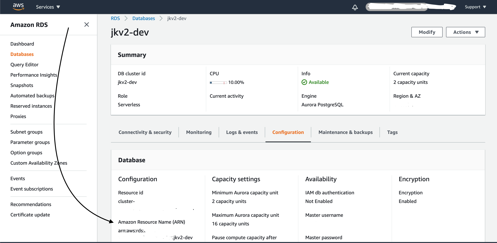
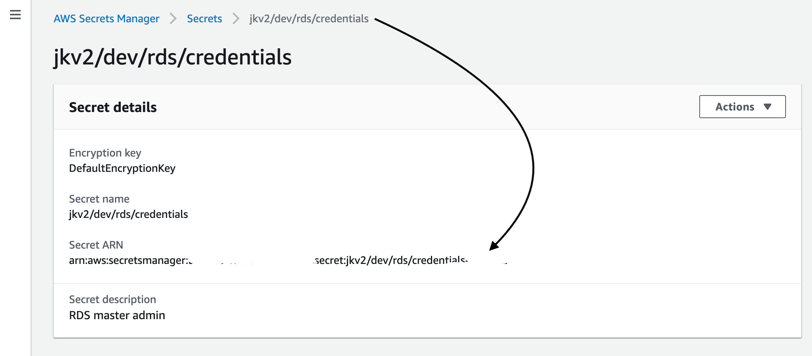
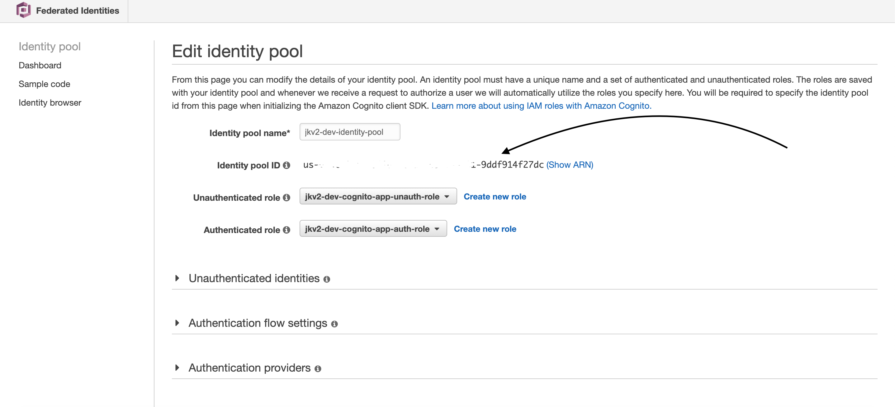
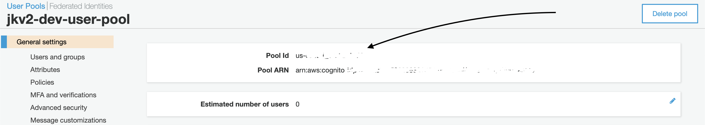
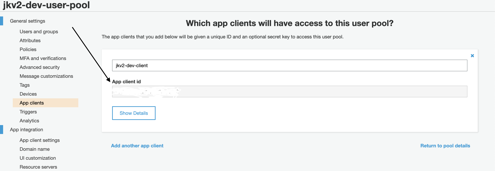

# JKv2 TypeScript Monorepo

Experimental JKv2 project template.

This includes JBCRA frontend, serverless backend with TypeORM connected to aurora serverless, and a core shared library.

[NPM workspaces](https://github.com/npm/rfcs/blob/latest/accepted/0026-workspaces.md) make it possible to import any of the packages in `packages/` from anywhere.

## Prerequisites

NPM v7

- `npm i -g npm@7`

## Quickstart

```shell
git clone --depth=1 --branch=develop git@github.com:jetbridge/jkv2-ts-template.git myapp
npm run template:init
```

`npm start` uses [concurrently](https://www.npmjs.com/package/concurrently) to launch core, backend, and frontend simultaneously.

## Syllabus
- [Developing against remote](#deploying-backend-and-hooking-it-up-to-the-frontend)
- [Developing locally](#developing-locally)

## Development
Developing against remote dev environment is recommended. As there it'll be possible to use Cognito authorizers and talk to the DB using Aurora data API(important, because things that work on localhost may not work the same with it).

### Deploying backend and hooking it up to the frontend
`cd packages/backend && sls deploy`

#### Initializing remote DB
Populate `packages/core/.env` with the following:

`RDS_ARN`:


`RDS_SECRET_ARN`:


`RDS_REGION`: the same region where your app was deployed. `us-east-1` by default

Then in `packages/core` run `npm run db:init:remote:dev` which will migrate and seed the database.
You may need to add `export AWS_PROFILE=<YOUR_PROFILE_TO_DEPLOY>` line before the actual command for it to work.

#### Hooking up frontend
Go to `.env` in `packages/frontend` and populate it:

`REACT_APP_BASE_URL`: Copy the API URL in the following format: `https://cb8ak40phc.execute-api.us-east-1.amazonaws.com`

`REACT_APP_API_NAME`: "${stageName}-${APP_NAME}"  # e.g. dev-jkv2

`REACT_APP_API_REGION`: the same region where your app was deployed.

`REACT_APP_COGNITO_IDENTITY_POOL_ID`:


`REACT_APP_COGNITO_REGION`, `REACT_APP_COGNITO_IDENTITY_POOL_REGION`: the same region where your app was deployed.

`REACT_APP_COGNITO_USER_POOL_ID`: 


`REACT_APP_COGNITO_USER_POOL_APP_CLIENT_ID`:


### Developing locally

#### Backend, initializing DB
Populate `packages/core/.env.local` with:
```
USE_LOCAL_DB = true
DB_NAME = jkv2 # YOUR_APP_NAME_HERE
DB_HOST = "localhost"
```

Initialize db by running `npm run db:init:local` in `packages/core`

#### Frontend
Using API client provided by Amplify for local development turns out to be troublesome. Requests via axios should work.


## Recommended Reading

These are some neat modules I found that are worth at least looking at. There very well may be better options out there, these are just some random ones I tried with this project:

- [http-errors](https://www.npmjs.com/package/http-errors) - generating error responses
- [lambda-middleware](https://dbartholomae.github.io/lambda-middleware/) - composable functions for things like schema validation, it would be nice if these were decorators
- [class-validator](https://github.com/typestack/class-validator) and [lambda-middleware class-validator](https://www.npmjs.com/package/@lambda-middleware/class-validator) - serdes + validation, [recommended](https://github.com/typeorm/typeorm/blob/master/docs/validation.md) by typeorm
- [typeorm](https://github.com/typeorm/typeorm) - ORM. supports migrations, aurora data API, modern TS features (decorators, async/await, TS, etc)
- [io-ts](https://github.com/gcanti/io-ts/blob/master/index.md) - a functional typescript-powered validation library that is recommended. not clear how to integrate with lambda+typeorm
- [ahaless](https://www.npmjs.com/package/@ahamove/ahaless) - interesting dependency injection library for serverless... might be cool?

## Next Steps

There is a LOT of room for improvement here. Some obvious enhancements could be:

- Utilizing class-transformer or something similar for serializing
- Go through [typeORM docs](https://github.com/typeorm/typeorm/tree/master/docs)
- Hook up DB migrations
- Figure out correct way to get/share DB connection handle
- Find or make decorators for easy request/response validation/serialization - maybe [class-transformer](https://github.com/typestack/class-transformer)
- Hook up OpenAPI (swagger) documentation
- Maybe generate OpenAPI TS client?
- Figure out authentication, using [HTTP API auth](https://docs.aws.amazon.com/apigateway/latest/developerguide/http-api-jwt-authorizer.html) and maybe cognito
- Error handling, maybe using [@lambda-middleware/http-error-handler](https://dbartholomae.github.io/lambda-middleware/packages/http-error-handler/)
- Frontend API support: check validation response automatically, authentication, etc
- Unified prettier/eslint configuration for the whole project
- Not sure if eslint should be set up per-package or at the top level
- GitHub actions
- Backend tests

## Troubleshooting

#### `Cannot find module 'jkv2-core' or its corresponding type declarations.`

Try `rm -rf node_modules package-lock.json` in the offending package and then run `npm i` from the top level directory
